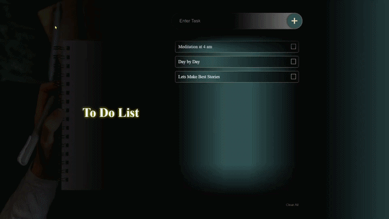

# 📝 To-Do List — Vanilla JS

A clean, animated To-Do List built with **HTML, CSS, and vanilla JavaScript** — no frameworks, no libraries. Tasks persist via `localStorage`.

🔗 **Live Demo:** [Click Here to View](https://sushildive012.github.io/ToDoList/)

<!-- Demo GIF: GitHub renders GIFs inline & auto-plays them (video tags don't).
Record the add-button click effect as a short screen capture, convert to GIF, then: -->
<!-- -->

<!-- Optional: full video walkthrough (won't autoplay in README, but clickable) -->
<!-- 🎥 [Watch full demo video](assets/demo.mp4) -->

## 3 secs WalkThrough
<video src="https://github.com/user-attachments/assets/b1da5e7f-2d5e-4a2f-92ab-c9e8eceb555b" width="350" controls autoplay loop muted></video>

---

## ✨ Features
- Add / delete tasks with smooth swipe & collapse animations
- Clear All with staggered exit transition
- Tasks persist across reloads (`localStorage`)
- Empty-state placeholder when list is empty
- Mobile-friendly: auto-dismisses keyboard on submit
- Responsive layout (mobile-first → desktop split view)

## 🛠️ Tech Stack
`HTML5` · `CSS3` (clamp, mask-image) · `Vanilla JavaScript` (DOM, event delegation)

## 📚 What I Learned
- **`setTimeout` chronology** — chaining delays correctly so CSS transitions, DOM updates, and array/storage updates fire in the right order instead of racing each other
- **Animate real dimensions, not just opacity** — used `height`/`margin` (0 → auto) alongside opacity/transform to get a true swipe-in/collapse effect, instead of just toggling visibility
- **Event delegation** — one listener on the parent container handles add/delete/clear-all instead of binding per element
- `HTMLCollection` vs `NodeList`, live vs static collections, and why re-querying the DOM matters after removals
- Using `-webkit-mask-image` for fade-edge scroll lists (with the iOS `transparent`-keyword gotcha)

⭐ **Favorite detail:** the add-button press animation (`.active` scale + shadow drop on click) — small touch, but it's what made the app *feel* real instead of static.

## 🚀 Run Locally
```bash
git clone https://github.com/sushildive012/ToDoList.git
cd ToDoList
# open index.html in your browser
```

## 📂 Structure
```
├── index.html
├── style.css
├── script.js
└── assets/
    ├── to-do-list.png
```
